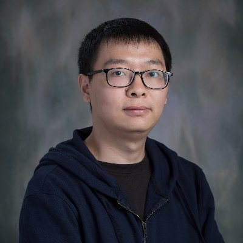

# Shuai Guo

PhD Student in Bioinformatics and Computational Biology

[Wenyi Wang Lab](https://odin.mdacc.tmc.edu/~wwang7/) @ University of Texas, MD Anderson Cancer Center

### Hi 👋 this is Shuai
- I'm currently a 6th year PhD student at University of Texas GSBS program, Houston, Texas.
- Before my PhD study, I finished my undergrad and mast degree in Cellular Biology at Central South University, Xiangya Medical School in China.
- I joined Dr. Wenyi Wang's Lab in April, 2020.

### My thesis project is about
- developing computational deconvolution methods to estimate cell-type compositions from bulk transcriptomics data.
- defining prostate cancer patient subtypes through genomic and transcriptomic deconvolution.
- biological annotation of clonal and subclonal variants in pan-cancer datasets.

### Publications
You can find my publications at [Google scholar homepage](https://scholar.google.com/citations?hl=en&user=uuEPxaQAAAAJ).

### Address
The M.D. Anderson T. Boone Pickens Academic Tower. 1400 Pressler St, Houston, TX 77030
